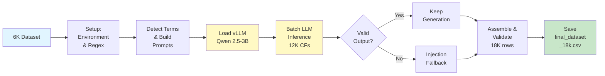

```mermaid
graph LR
    subgraph Setup["🔧 Setup"]
        A["18K Dataset<br/>+ t2i_prompts"]
        B["ComfyUI<br/>Framework"]
        A --> B
    end
    
    subgraph Models["📦 Models 17GB VRAM"]
        C["Z-Image-Turbo<br/>UNet FP8<br/>9-step"]
        D["CLIP Qwen<br/>3.4B<br/>Embeddings"]
        E["VAE<br/>720×720<br/>PNG"]
        C --> D
        D --> E
    end
    
    subgraph Loop["🔄 Batch Processing"]
        F["Batch 148"]
        G["Encode"]
        H["KSampler<br/>CFG=1.0"]
        I["VAE Decode"]
        J{VRAM OK?}
        K["Save PNG"]
        F --> G
        G --> H
        H --> I
        I --> J
        J -->|✓| K
        J -->|OOM| F
    end
    
    subgraph Finish["✅ Finalize"]
        L["Checkpoint<br/>5 batches"]
        M["Compress<br/>.zip"]
        L --> M
    end
    
    B --> C
    E --> F
    K --> L
    
    style A fill:#e1f5ff
    style C fill:#fff9c4
    style D fill:#fff9c4
    style E fill:#fff9c4
    style K fill:#c8e6c9
    style M fill:#c8e6c9
    style J fill:#ffccbc
```

# Counterfactual & Image Generation Pipelines

This document outlines the complete data flow for both counterfactual text generation and image generation pipelines in the ML bias evaluation project.

---

## 1. Counterfactual Text Generation Pipeline

The counterfactual pipeline transforms 6,000 original hate speech samples into 18,000 rows by generating identity-substituted variants using an LLM.

### Data Flow



### Key Processing Steps

| Step | Input | Process | Output |
|------|-------|---------|--------|
| **Detection** | Original text | Regex pattern matching | List of identity terms + axes |
| **Prompt Design** | Detected terms + target group | Select replacement terms via seeded hash | LLM prompt (explicit or implicit) |
| **LLM Generation** | 12K prompts | vLLM batched inference (Qwen 2.5-3B) | Raw counterfactual text |
| **Cleaning** | Raw LLM output | Remove prefixes, validate length ratio, check Unicode | Clean counterfactual text |
| **Fallback** | Failed cleaning | Insert identity reference naturally | Injection-based counterfactual |
| **Assembly** | 6K originals + 12K CFs | Stack with metadata (cf_type, target_group) | 18K-row DataFrame |
| **Validation** | 18K rows | Group by sample_id, expect 3 rows each | Dropped orphans |

### Dataset Structure (Output)

```
final_dataset_18k.csv
├── original_sample_id    (unique sample identifier)
├── counterfactual_id     (unique row identifier)
├── text                  (generated counterfactual or original)
├── class_label           (8 classes: hate_*, offensive_*, neutral_*, etc.)
├── target_group          (race/ethnicity, religion, gender, etc.)
├── polarity              (hate or non-hate)
├── cf_type               (original | counterfactual_1 | counterfactual_2)
├── t2i_prompt            (placeholder for text-to-image prompt)
└── hate_score, confidence (populated later)

Total Rows: 18,000 (6,000 × 3)
```

---

## 2. Image Generation Pipeline

The image generation pipeline converts text prompts into 720×720 photorealistic images using the Z-Image-Turbo diffusion model on an H200 GPU.

### Data Flow



### Key Processing Steps

| Step | Input | Process | Output |
|------|-------|---------|--------|
| **Model Loading** | ComfyUI + model weights | Download & load onto GPU (FP8) | 3 models in VRAM (17 GB) |
| **Batching** | 18K rows with prompts | Split into batches of 148 | Batch metadata (IDs, prompts) |
| **CLIP Encoding** | Text prompts | Encode via Qwen 3.4B w/ EOS pooling | Conditioning tensors (batched) |
| **KSampler** | Conditioning + latent | 9-step Euler diffusion at CFG=1.0 | Latent samples |
| **OOM Handling** | Batch size | VRAM check → recursively halve if OOM | Successful generation or skip |
| **VAE Decode** | Latent samples | Decode to images in [0, 1] float32 | RGB images [N, 720, 720, 3] |
| **Save** | Decoded images | Convert to uint8 PNG | PNG files ×18K |
| **Checkpointing** | Completed rows | Save every 5 batches | CSV with image paths |
| **Compression** | Raw images + metadata | Zip images, then archive all outputs | Zipped complete dataset |

### Generation Settings

| Parameter | Value | Rationale |
|-----------|-------|-----------|
| **Model** | Z-Image-Turbo FP8 | Fast (9 steps), photorealistic |
| **Resolution** | 720×720 | Balance quality & speed & VRAM |
| **Steps** | 9 | Minimal for quality on Z-Image-Turbo |
| **CFG Scale** | 1.0 | Prompt guidance (lower = more creative) |
| **Sampler** | Euler | Standard, stable diffusion sampler |
| **Batch Size** | 148 | H200 ~120 GB headroom ÷ 90 MB/img |
| **Positive Prefix** | 8K uhd, photorealistic, ... | Consistent high-quality aesthetic |
| **Negative Prefix** | low quality, cartoon, ... | Excludes unwanted artifacts |

### Dataset Output Structure

```
combined_dataset_with_images.csv
├── (all original columns from input)
├── generated_image_path     (path to PNG)
├── total_successful         (count)
├── total_failed             (count)
├── generation_timestamp     (ISO 8601)
├── image_resolution         (720x720)
└── batch_size_used          (148)

Total Rows: 18,000
Total Images: ~18K PNGs (720×720)
Archive: complete_output.zip
```

---

## 3. Unified Data Pipeline


---

## 4. Checkpointing & Recovery

Both pipelines support **resumable execution**:

### Counterfactual Pipeline
- No explicit checkpointing (vLLM runs entire 12K batch in one go)
- All 12K prompts complete or none are saved

### Image Generation Pipeline
- **Checkpoint file**: `checkpoint_progress.csv` (every 5 batches)
- **Format**: `[counterfactual_id, image_path, timestamp]`
- **Resume**: Script auto-detects checkpoint, filters dataset, resumes from last batch
- **Failed IDs**: Logged separately in `failed_generations.csv`

---

## 5. Error Handling & Robustness

### Counterfactual Pipeline
| Error | Handling |
|-------|----------|
| LLM output too short/long | Fallback to injection (append identity reference) |
| Identical after swap | Discard, try injection |
| Non-ASCII/emoji noise | Regex cleaning filters and rejects |
| Dataset validation | Drop orphans (sample_ids without 3 rows) |

### Image Generation Pipeline
| Error | Handling |
|-------|----------|
| CUDA OOM during sampling | Recursively halve batch size |
| CUDA OOM during VAE decode | Per-image decode fallback |
| Image generation failure | Blank image (zeros), log to failed IDs |
| Prompt encoding error | Skip entire batch (logged) |

---

## 6. Environment & Dependencies

### Counterfactual Pipeline
```yaml
Python: 3.11+
Key Libraries:
  - polars (dataframe)
  - torch (GPU)
  - vllm (LLM inference)
  - transformers (tokenizer)
  - regex (pattern matching)
```

### Image Generation Pipeline
```yaml
Python: 3.10+
Key Libraries:
  - torch, torchvision (GPU)
  - pillow (image I/O)
  - polars (dataframe)
  - comfyui (diffusion nodes)
Hardware:
  - H200 80 GB HBM3e (recommended)
  - or 2× T4 16 GB (fallback, slower)
```

---

## 7. Execution Commands

```bash
# Counterfactual generation (Kaggle notebook cell-by-cell or standalone)
python3 src/scripts/CF-Gen.py

# Image generation (Lightning AI notebook)
python3 src/scripts/image_gen.py

# Full pipeline (from dataset to final splits)
bash run_all_phases.sh
```

---

## 8. Performance Metrics

| Stage | GPU | Duration | Throughput |
|-------|-----|----------|-----------|
| **CF Generation** | 2× T4 16GB | ~60 min | 200 CF/s |
| **Image Generation** | 1× H200 80GB | ~45 min | 400 img/min (148-batch) |
| **Total Time** | Mixed | ~2 hours | Full 18K multimodal |

---

## References

- **CF-Gen.py**: Counterfactual generation via vLLM (Qwen 2.5-3B)
- **image_gen.py**: Image generation via ComfyUI (Z-Image-Turbo)
- **canonical_splits.py**: Official train/val/test split definitions
- **CLAUDE.md**: Detailed architecture & results truths table
