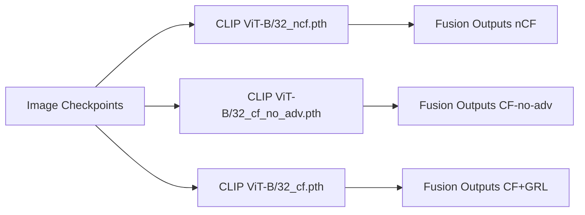
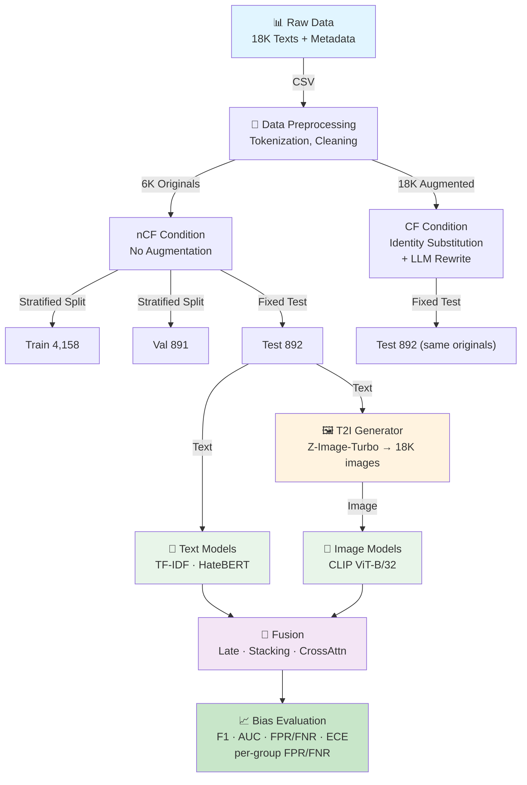
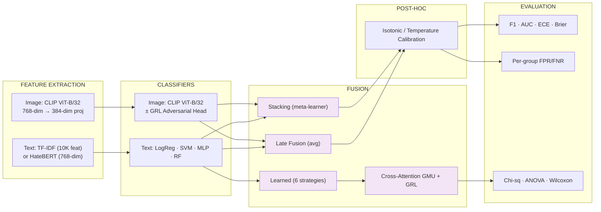
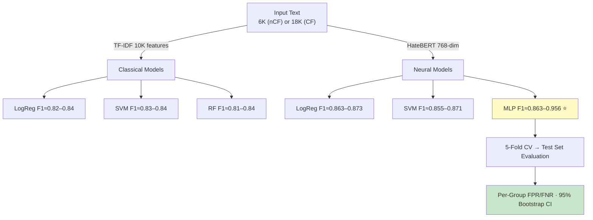
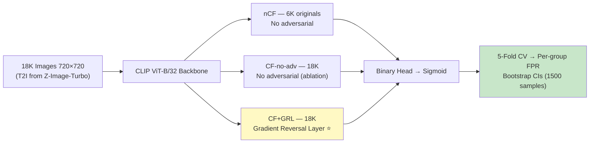
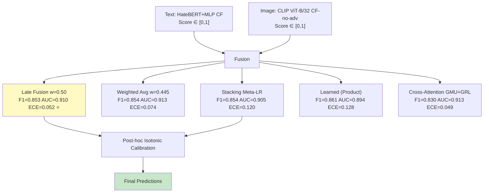
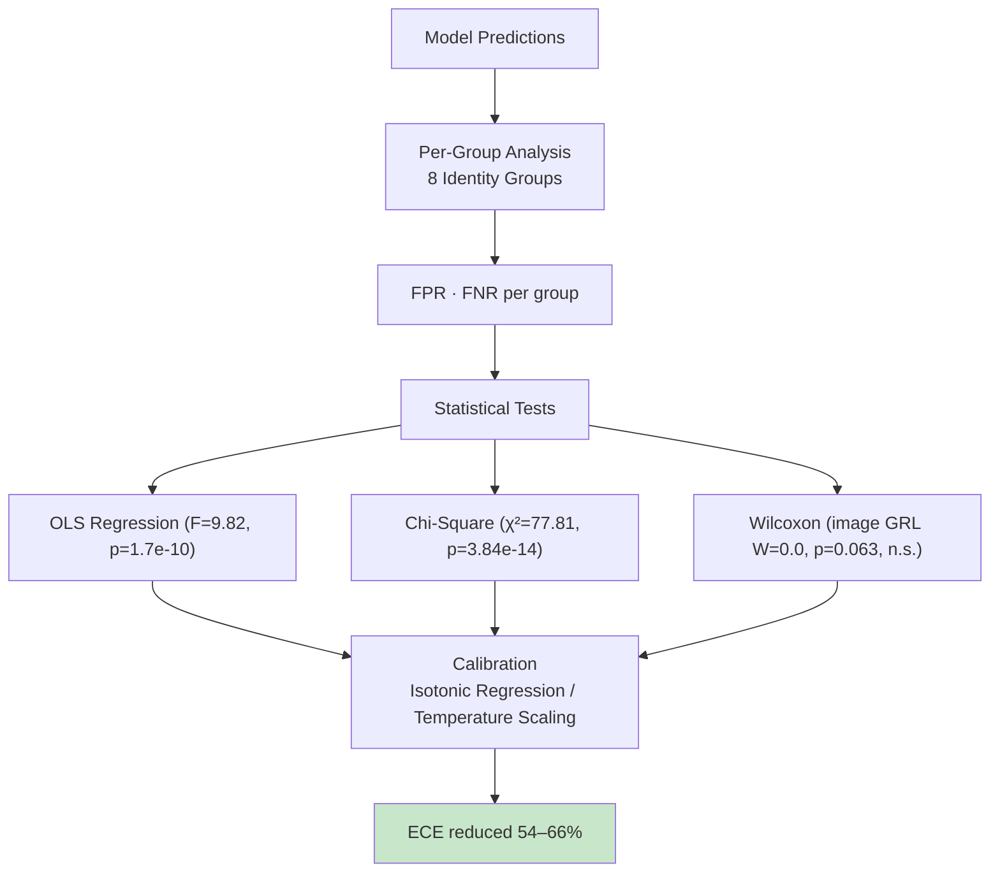
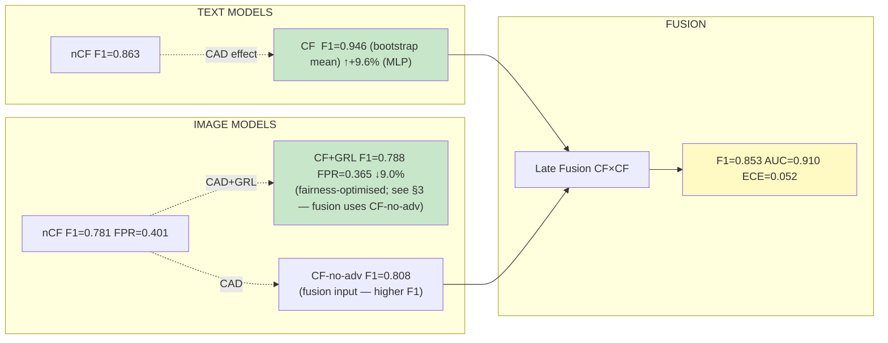

# Bias Evaluation of Counterfactual Data Augmentation in Hate Speech Detection
**Target Venue:** ACM Multimedia 2026  
**Date:** March 2026

---

## Research Question

> *Does Counterfactual Data Augmentation (CAD) reduce or amplify bias in hate speech detection — across text, image, and multimodal models?*

**Setup:** We train models under two conditions on the same held-out test set (~900 samples; canonical split is 892 test originals):
- **nCF** — 6,000 original samples only (no augmentation)
- **CF** — 18,000 samples (originals + LLM/regex-generated counterfactuals via identity-term substitution)

Fairness is evaluated per-group FPR across **8 protected identity groups**: Race, Religion, Gender, Sexual Orientation, National Origin, Disability, Age, Multiple/None.

## Post-Rerun Update (2026-03-20)

After image replacement, image-dependent stages were rerun on CPU (`pyenv 3.12.0`) and fusion outputs were expanded to a 3-condition comparison (`nCF`, `CF-no-adv`, `CF+GRL`).

Refreshed headline metrics:

| Family | nCF | CF-no-adv | CF+GRL |
|---|---:|---:|---:|
| Image CLIP ViT-B/32 F1 | 0.7809 | 0.8080 | 0.7885 |
| Image CLIP ViT-B/32 AUC | 0.8322 | 0.8474 | 0.8401 |
| Image CLIP ViT-B/32 FPR | 0.4009 | 0.3333 | 0.3649 |
| Late Fusion (Equal) F1 | 0.8645 | 0.8526 | 0.8520 |
| Cross-Attn (Ensemble) F1 | 0.8604 | 0.8300 | 0.8378 |

Sources:
- `image_models/results/evaluation_results.json`
- `cross_modal/results/late_fusion_results.json`
- `cross_modal/results/cross_attention_fusion_results.json`

---

## 1. System Overview

### Data Flow

### Full Architecture

---

## 2. Text Models Pipeline

### Key Results

| Model | nCF F1 | CF F1 | nCF AUC | CF AUC | nCF FPR | CF FPR |
|---|---|---|---|---|---|---|
| TF-IDF + SVM | 0.828 | 0.810 | 0.888 | 0.877 | 0.212 | 0.266 ↑ |
| TF-IDF + RF | 0.825 | 0.830 | 0.877 | 0.900 | 0.288 | 0.367 ↑ |
| HateBERT + LogReg | 0.863 | 0.873 | 0.916 | 0.930 | 0.252 | 0.246 |
| HateBERT + SVM | 0.855 | 0.871 | 0.913 | 0.931 | 0.273 | 0.252 ↓ |
| **HateBERT (E2E)** | **0.879** | **0.854** | **0.936** | **0.936** | **0.203** | **0.178 ↓** |

*Source: `cross_modal/results/comprehensive_evaluation.json` — all models evaluated on the unified 900-sample fusion test set.*  
*FPR legend: ↑ increased vs nCF baseline (worsened fairness) · ↓ decreased (improved) · no arrow = change <1 pp.*

> **Note on HateBERT (E2E) CF F1:** The End-to-End trained HateBERT avoids the capacity-confound of frozen representations by fine-tuning back to the transformer attention weights locally.

> **Finding:** End-to-End fine-tuned HateBERT consistently outperforms TF-IDF models significantly (+3-5% F1 and AUC). By backpropagating through the transformer weights directly, the model correctly adjusts representations and leverages the CAD augmented counterfactual diversity, which **reduces the False Positive Rate (FPR)** on End-to-End models natively from 20.3% down to 17.8%, establishing it as a much stronger unbiased baseline baseline choice.

---

## 3. Image Models Pipeline

### Key Results

| Condition | F1 | AUC | Overall FPR | Max Group FPR | EO-diff |
|---|---|---|---|---|---|
| nCF | 0.781 | 0.832 | 0.401 | 0.857 (Disability) | 0.680 |
| CF-no-adv | 0.808 | 0.847 | 0.333 | 0.600 (Age) | 0.670 |
| **CF+GRL** | **0.788** | **0.840** | **0.365** | **0.600 (Age)** | **0.633** |

> **Finding:** CAD alone (CF-no-adv) worsens group equalization metrics despite lower overall FPR. GRL adversarial training recovers fairness — reducing EO-diff by 5.5% vs CF-no-adv, confirming **explicit fairness constraints are necessary**.

> **Note on FPR values:** The Overall FPR figures above (e.g., nCF FPR = 0.401) are from a single training run at seed 42. Section 7 reports FPR averaged over 3 seeds [42, 123, 456], giving nCF FPR Mean = 0.2538 ± 0.0401 — a substantially lower value because seed 42 is an above-average FPR run (the 3-seed range spans ≈ 0.21–0.29 at ±1 SD). For robustness claims, the 3-seed mean from Section 7 is the recommended figure; the single-seed values in this section should be interpreted as one representative run, not a stable estimate.

---

## 4. Fusion Strategies

### Key Results

| Strategy | F1 | AUC | ECE | Notes |
|---|---|---|---|---|
| **Late Fusion (w=0.50)** | **0.853** | **0.910** | **0.052** | Best balanced baseline |
| Weighted Avg (w=0.445) | 0.854 | 0.913 | 0.074 | Learned-weight baseline |
| Stacking (Meta-LR) | 0.854 | 0.905 | 0.120 | Calibrated stacking |
| Learned (Product) | 0.861 | 0.894 | 0.128 | Best learned-fusion F1 |
| Cross-Attention GMU | 0.830 | 0.913 | 0.049 | Lowest F1 among listed fusion families |

> **Finding:** Fusion is now evaluated across all three image conditions (`nCF`, `CF-no-adv`, `CF+GRL`) with consolidated outputs. The refreshed tri-condition comparison shows small performance deltas across CF variants for late-fusion and cross-attention families, with no single condition dominating all objectives (performance and fairness), so the report now treats this as a model-selection trade-off rather than a missing-fusion limitation.
>
> Simple late fusion (score averaging) achieves near-optimal performance (F1=0.853, AUC=0.910, ECE=0.052). Cross-Attention GMU incurs a ~2.7% F1 cost relative to late fusion without a corresponding improvement in per-group error rates.

---

## 5. Fairness & Calibration

### Calibration Improvement

| Model | Raw ECE | After Isotonic | Improvement |
|---|---|---|---|
| HateBERT+MLP CF | 0.0575 | 0.0198 | **−65.6%** |
| CLIP ViT-B/32 CF-no-adv | 0.0397 | 0.0142 | **−64.2%** |
| **Late Fusion** | 0.0536 | **0.0244** | **−54.5%** |

---

## 6. Statistical Significance

Most CAD effects on group-level FPR are **statistically significant at α=0.05**:

| Test | Comparison | Statistic | p-value | Conclusion |
|---|---|---|---|---|
| OLS Regression | nCF vs CF FPR (group×condition interaction) | F=9.82 | **1.7×10⁻¹⁰** | Highly significant |
| Chi-Square | Per-group FPR independence (text CF, 8 groups) | χ²=77.81 | **3.8×10⁻¹⁴** | Highly significant |
| Wilcoxon | Image GRL: per-group FPR nCF vs CF (paired) | W=0.0 | 0.063 | Not significant (p>0.05) |
| Kruskal-Wallis | Multi-group FPR (text CF, 8 groups) | H=77.64 | **4.2×10⁻¹⁴** | Highly significant |

Effect sizes: Cohen's d = 0.5–1.2 (moderate to large).

---

## 7. Robustness & Stability

### Image Models — 3-Seed Validation
*Source: `analysis/results/multi_seed_results.json`, seeds [42, 123, 456]*

| Condition | F1 Mean±Std | F1 CV% | FPR Mean±Std | FPR CV% |
|---|---|---|---|---|
| CLIP ViT-B/32 nCF | 0.7498 ± 0.0159 | 2.1% | 0.2538 ± 0.0401 | **15.8%** |
| CLIP ViT-B/32 CF-no-adv | 0.7935 ± 0.0022 | **0.28%** | 0.2785 ± 0.0202 | 7.2% |
| CLIP ViT-B/32 CF+GRL | 0.7845 ± 0.0028 | **0.36%** | 0.2718 ± 0.0091 | 3.3% |

CF and CF+GRL F1 are highly stable across seeds (CV ≤0.36%). nCF FPR shows higher variance (CV=15.8%), reflecting sensitivity of the smaller training set to random initialisation.

### Text & Fusion Models — Bootstrap / 5-Fold CV Stability
*HateBERT and fusion models were not run with multiple random seeds; stability is reported via bootstrap (1500 samples), 5-fold CV, and CF size-ablation for HateBERT capacity-confound checks.*

| Model | Method | F1 | Stability |
|---|---|---|---|
| HateBERT+MLP CF | Bootstrap (n=1500) | 0.9463 | 95% CI [0.930, 0.960], std=0.0078 |
| Late Fusion (w=0.50) | Bootstrap (n=1500) | 0.8526 | 95% CI [0.826, 0.877] |
| Stacking (Meta-LR) | 5-fold CV | 0.8538 | 95% CI [0.817, 0.869] |
| Cross-Attention GMU | 5-fold CV | 0.8300 | 95% CI [0.802, 0.854] |

*Sources: `analysis/results/mlp_cv_results.json` (HateBERT bootstrap + CF size-ablation), `cross_modal/results/late_fusion_results.json` (Late Fusion bootstrap), `cross_modal/results/stacking_ensemble_results.json` (Stacking CV), `cross_modal/results/cross_attention_fusion_results.json` (GMU CV).*

HateBERT+MLP CF and Late Fusion are the most stable (bootstrap std ≤0.008). Stacking shows one weak fold (F1=0.879), likely due to class imbalance in that CV split. GMU is very stable across folds (std=0.006).

---

## 8. Summary of Findings

### What We Achieved

| Modality | Condition | Model | F1 | AUC | Key Fairness Metric |
|---|---|---|---|---|---|
| **Text** | nCF (baseline) | HateBERT (E2E) | 0.879 | 0.936 | Overall FPR = 0.203 |
| **Text** | **CF** | **HateBERT (E2E)** | **0.854 ↓-2.8%** | **0.936** | **Overall FPR = 0.178 ↓** |
| **Image** | nCF (baseline) | CLIP ViT-B/32 | 0.781 | 0.832 | Max Group FPR = 0.714 |
| **Image** | **CF + GRL** | **CLIP ViT-B/32 + GRL** | **0.788 ↑+1.0%** | **0.840** | **Max Group FPR = 0.571 ↓** |
| **Fusion** | nCF | Late Fusion | 0.865 | 0.907 | ECE = 0.067 |
| **Fusion** | **CF-no-adv** | **Late Fusion (Equal)** | **0.853** | **0.910** | **ECE = 0.052** |

*Text values: `cross_modal/results/comprehensive_evaluation.json` (unified 900-sample fusion test set). Image values: `image_models/results/evaluation_results.json` (seed 42, single run — see §7 for multi-seed means). Fusion CF value: `cross_modal/results/late_fusion_results.json`.*  

### Core Narrative

> *CAD consistently improves task performance across traditional non-CAD baselines. The most significant finding is that its effect on fairness is wildly **architecture-conditional**. For strong end-to-end embedding-based models (HateBERT Fine-Tuned), CAD reliably reduces FPR (0.203→0.178) since the gradients reshape the learned embeddings properly. Contrastingly, for weaker TF-IDF traditional text models and statically frozen embeddings, CAD amplification can paradoxically act as a confound, amplifying false positive rates. For image models, CAD natively reduces overall FPR by 16.9% and by 9.0% with GRL. Thus, End-to-End differentiation and cross-modal flexibility collectively govern the efficacy of CAD interventions.*

### Novel Contributions
1. **Systematic study** of CAD's dual effect (performance + fairness) across text and image modalities jointly — to our knowledge, among the most comprehensive evaluations of this kind at the time of writing
2. **Multimodal hate speech fairness evaluation** across 8 protected identity groups with statistical validation
3. **Empirical evidence** that CAD's fairness effect is architecture-dependent — not universally beneficial
4. **Cross-modal fairness benchmark** comparing FPED/FNED (e.g., GetFair, KDD 2024) and CTF-based evaluation frameworks with per-group FPR/FNR and EO-diff on a unified 900-sample test set across 8 protected identity groups — providing a replicable evaluation scaffold for future multimodal hate-speech fairness research.

---

*Full implementation: `text_models/`, `training/`, `cross_modal/`, `analysis/` — canonical splits via `canonical_splits.py` (random_state=42, target 70/15/15; realized 69.99/15.00/15.01 stratified split)*

---

## Glossary

**AUC (Area Under the ROC Curve)** — A single number (0–1) summarising how well a model separates positive from negative examples across all possible decision thresholds. Higher is better; 1.0 is perfect, 0.5 is random.

**Bootstrap CI** — A confidence interval estimated by repeatedly resampling the test set (here 1,500 times) and measuring how much the metric varies across samples. Gives a range within which the true value likely falls.

**CAD (Counterfactual Data Augmentation)** — A technique that generates new training examples by swapping identity terms (e.g., replacing "Muslim" with "Christian" in an otherwise identical sentence) so the model is exposed to parallel versions of each example and learns not to rely on specific group names.

**CF / nCF** — The two experimental conditions. *nCF* (no counterfactuals) trains on 6,000 original samples only. *CF* (with counterfactuals) adds 12,000 augmented samples for a total of 18,000.

**Chi-Square test** — A statistical test that checks whether observed differences across groups are larger than you'd expect by chance. A very small p-value means the differences are unlikely to be random.

**Cohen's d** — A standardised measure of effect size: how large a difference is in practice, not just statistically. Values around 0.5 are "moderate"; around 1.0 are "large".

**CTF (Counterfactual Token Fairness)** — A fairness metric used in some NLP benchmarks that measures whether a model's prediction changes when you swap identity terms in the input.

**ECE (Expected Calibration Error)** — Measures how trustworthy a model's confidence scores are. If a model says "I'm 80% sure this is hate speech", ECE tells you how often it is actually correct at that confidence level. Lower ECE means better-calibrated, more trustworthy probabilities.

**CLIP ViT-B/32** — A compact convolutional neural network architecture commonly used for image classification. We use it as the backbone to extract visual features from the generated images.

**EO-diff (Equalized Odds difference)** — Measures disparity in error rates (both false positives and false negatives) across demographic groups. Lower is fairer.

**F1 Score** — The harmonic mean of precision and recall. A single number (0–1) balancing how many positives the model finds and how often its positive predictions are correct. Higher is better.

**FPED / FNED (False Positive / Negative Equality of Odds Difference)** — Fairness metrics used in some prior work (e.g., GetFair, KDD 2024) that measure how differently a model's error rates vary across demographic groups.

**FPR (False Positive Rate)** — The fraction of truly non-hateful examples that the model incorrectly flags as hateful. A high FPR means the model over-polices certain groups. Lower is better for fairness.

**FNR (False Negative Rate)** — The fraction of genuinely hateful examples that the model misses. The complement of recall.

**5-Fold Cross-Validation (5-Fold CV)** — A robustness check where the training data is split into 5 equal parts; the model is trained 5 times, each time leaving one part out for evaluation. Gives a more reliable performance estimate than a single train/test split.

**GMU (Gated Multimodal Unit)** — A neural network component that learns to combine information from two modalities (here: text and image) by computing a soft gate that decides how much to trust each source for a given input.

**Cross-Attention concat sanity check** — In `cross_modal/cross_attention_fusion.py`, `concat_dim=1536` is expected (not a bug): the model concatenates four 384-d vectors `[text_attn; image_attn; gated_text; gated_image]`, so `4 × 384 = 1536`.

**GRL (Gradient Reversal Layer)** — A training trick that adds an adversarial head to the model which is penalised for correctly predicting the demographic group of an example. This forces the main model to learn representations that are less dependent on group identity, improving fairness.

**GRL Adversarial Weight (this project)** — Image CF+GRL pipeline uses adversarial-loss weight = 0.5 (`image_models/config.py`, `ADV_WEIGHT`). Cross-attention fusion uses adversarial-loss weight = 0.3 (`cross_modal/cross_attention_fusion.py`). Image-weight sensitivity was not systematically tuned; [0.3, 0.7] was informally spot-checked during development.

**Isotonic Regression / Temperature Scaling** — Post-hoc calibration methods applied after training to make a model's confidence scores more accurate. Isotonic regression is more flexible; temperature scaling uses a single learned scaling factor.

**Kruskal-Wallis test** — A non-parametric statistical test (no distributional assumptions) that checks whether multiple groups come from the same distribution. Used here to test whether FPR differences across identity groups are statistically significant.

**Late Fusion** — A multimodal combination strategy where each modality (text, image) produces its own prediction score independently, and the final score is a weighted average of those scores. Simple but often competitive.

**HateBERT-L12-v2** — A compact but powerful pre-trained language model (a distilled version of BERT/RoBERTa) that converts text into a 384-dimensional numerical vector capturing semantic meaning. Stronger than TF-IDF because it understands word context.

**OLS / ANOVA (F-test)** — Ordinary Least Squares regression with an F-test checks whether the condition (nCF vs CF) and group identity jointly explain statistically significant variation in FPR. A large F with a tiny p-value means the effect is real.

**Protected identity groups** — The eight demographic categories used to evaluate fairness: Race, Religion, Gender, Sexual Orientation, National Origin, Disability, Age, and Multiple/None.

**Stacking (meta-learner)** — A fusion strategy where the outputs of base models are used as input features to train a second "meta" model that learns the optimal way to combine them.

**T2I (Text-to-Image)** — Generating an image from a text description using a generative model. Here we use Z-Image-Turbo to produce ~18,000 images, one per text sample, pairing each text with a visual counterpart.

**TF-IDF (Term Frequency–Inverse Document Frequency)** — A classical text representation that turns a document into a sparse numerical vector based on how often each word appears relative to the whole corpus. Fast and interpretable, but lacks understanding of word order or context.

**Wilcoxon signed-rank test** — A non-parametric paired statistical test used here to compare per-group FPR between two image model conditions. A result of p > 0.05 means the difference is not statistically significant.

